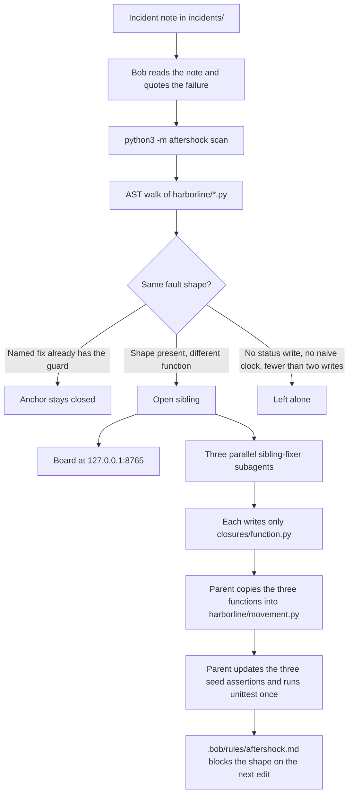
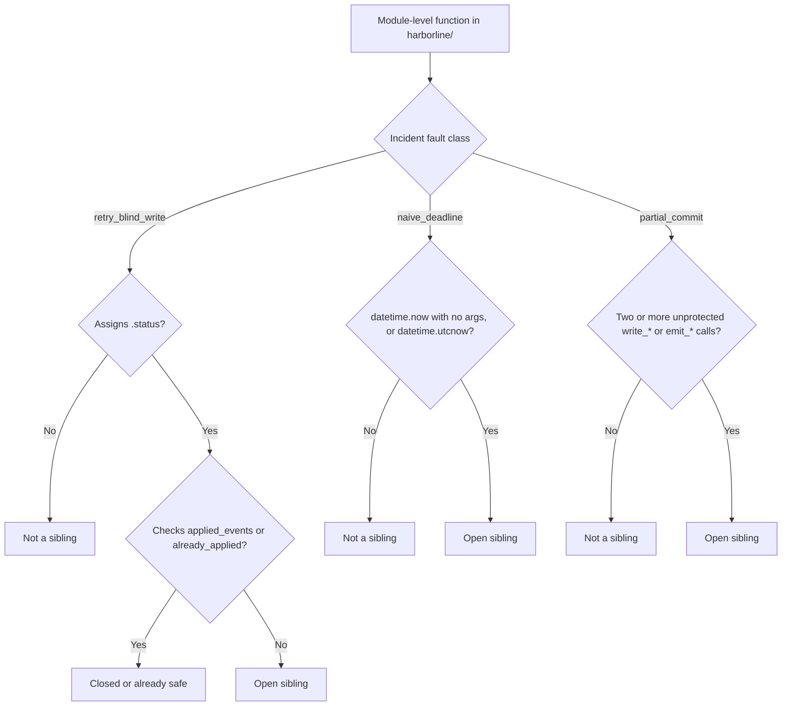
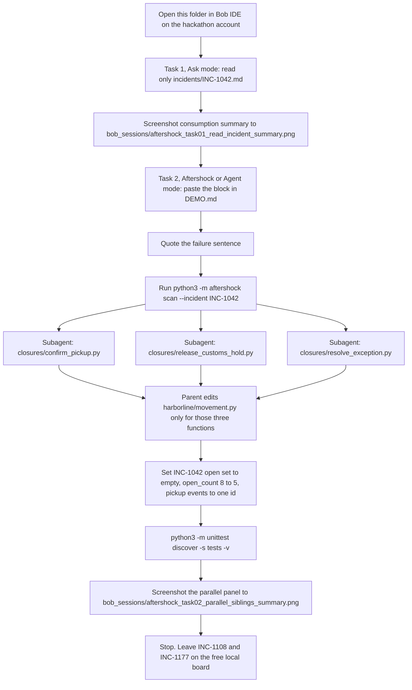

# Aftershock

Aftershock is a post-incident maintenance workflow for the [IBM Bob 2.0 hackathon](https://lablab.ai/ai-hackathons/ibm-bob-2-hackathon). An incident fix closes one function. Sibling functions still fail the same way. Aftershock names every sibling. IBM Bob closes that class in parallel.

The model does not decide what is still broken. A structural scan does. Bob only writes the patch.

That split is the product. A chat that is asked to "find similar bugs" spends the context window on search, and the list can change between runs. Aftershock fixes the list first. Python's `ast` module walks Harborline, matches one fault shape, and returns the same siblings every time. That step spends 0 Bobcoins. Bob then receives one function and one file to write. Three of those tasks run together. The parent applies them and runs the tests once.

Public repository: https://github.com/krabhi75/aftershock

The sample product is Harborline, a fictional parcel-hub library. Parcel id `HBL-44021` is made up. The three incident notes were written for this repo. They contain no personal information, no client data, no confidential data, and no text copied from a website.

## What a fresh clone shows

| | Count |
| --- | --- |
| Incidents | 3 |
| Anchors that stayed closed | 3 |
| Siblings still open | 8 |
| Bobcoins spent by the scan | 0 |

Python 3.11 or newer. The standard library is enough. There are no API keys.

## Flow

An incident note names one fixed function. The local scanner walks Harborline with Python's `ast` module and asks one question of every other function: does it still have that shape? Matches become open siblings. Functions that already have the guard stay closed. Bob does not search the tree. Bob reads the incident, then one subagent writes one replacement per open sibling.



The scan is the box that spends 0 Bobcoins. The boxes from "Bob reads the note" through "unittest once" are the only boxes that should run inside Bob IDE, and only for **one** incident, INC-1042, unless coins remain.

## The three fault classes

Each incident file has YAML front matter: `id`, `title`, `fault_class`, `fixed_symbol`. The prose under the front matter is what Bob quotes. The scanner uses the front matter so the classification does not depend on a model.

| Class | Plain name | What the scanner flags | Closed pattern |
| --- | --- | --- | --- |
| `retry_blind_write` | Retry wrote twice | A function assigns `.status` and never tests `applied_events` and never calls `already_applied` or `ensure_once` | `confirm_delivery` returns early when `event_id` is already in `parcel.applied_events` |
| `naive_deadline` | Clock forgot its timezone | A function calls `datetime.now()` with no arguments, or calls `datetime.utcnow()` | `hub_intake_deadline` keeps the instant in UTC. `datetime.now(timezone.utc)` is closed |
| `partial_commit` | Two writes, no rollback | Two or more `write_*` or `emit_*` calls sit outside both `with store.unit_of_work()` and a `try` whose handler calls `void_*`, `rollback*`, or `compensate*` | `print_outbound_label` wraps label and manifest writes in `unit_of_work`, which restores both lists if the second write raises |

One write is not a partial commit. A function that only reads `.status` or calls `read_rate` is not a sibling. A membership test on `applied_events` anywhere in the function counts as the retry guard.



If the symbol named in `fixed_symbol` still matches the shape, the report marks that anchor `regressed` instead of `closed`. On this sample all three anchors are closed.

## Seeded sites

### INC-1042 — Retry wrote twice

Fixed anchor: `harborline.movement.confirm_delivery`

On 12 March the west hub received the carrier webhook for parcel HBL-44021 twice, 90 seconds apart, because the first acknowledgement timed out. `confirm_delivery` appended the event a second time. The patch records `event_id` on `applied_events` and returns when that id is already present.

| Symbol | Line behavior | Verdict |
| --- | --- | --- |
| `confirm_delivery` | Returns when `event_id` is already applied, then sets `delivered` | Closed anchor |
| `confirm_pickup` | Sets `picked_up` and appends the event with no check | Open |
| `release_customs_hold` | Sets `released` and appends the event with no check | Open |
| `resolve_exception` | Sets `resolved` and appends the event with no check | Open |
| `record_weighstation` | Has the same guard as delivery, then sets `weighed` | Safe, not listed |
| `preview_status` | Returns `parcel.status` and does not assign it | Safe, not listed |

A second call to `confirm_delivery` with the same event id leaves `events == ["evt-1"]`. A second call to `confirm_pickup` leaves `events == ["evt-1", "evt-1"]`.

### INC-1108 — Clock forgot its timezone

Fixed anchor: `harborline.clocks.hub_intake_deadline`

A parcel scanned at 18:10 in a hub seven hours behind UTC was compared with `datetime.now()` and no timezone. The naive clock treated the instant as late while the parcel was still inside its promise window.

| Symbol | What it calls | Verdict |
| --- | --- | --- |
| `hub_intake_deadline` | Converts the caller's datetime to UTC, then adds 6 hours | Closed anchor |
| `shift_change_deadline` | `datetime.now(timezone.utc)` | Safe, not listed |
| `format_deadline_label` | Formats a datetime the caller already computed | Safe, not listed |
| `linehaul_departure_deadline` | `datetime.now()` plus 4 hours | Open |
| `customer_promise_deadline` | `datetime.now()` plus 2 days | Open |
| `hold_expiry` | `datetime.now()` stored in `current`, plus 12 hours | Open |

`hub_intake_deadline` of 18:10 at UTC−7 is 07:10 UTC on the next calendar day.

### INC-1177 — Two writes, no rollback

Fixed anchor: `harborline.paperwork.print_outbound_label`

The manifest service raised after the label write had already landed. Dock staff applied a label for parcel HBL-44021, and that parcel was on no truck.

| Symbol | Writes | Verdict |
| --- | --- | --- |
| `print_outbound_label` | `write_label` and `write_manifest` inside `unit_of_work` | Closed anchor |
| `quote_label_cost` | `read_rate` only | Safe, not listed |
| `book_return_leg` | `write_label` then `write_manifest`, no unit of work | Open |
| `reroute_mid_flight` | `write_label` then `write_route`, no unit of work | Open |

`Store(fail_manifest=True)` makes `write_manifest` raise. On the closed path the label list is empty afterward. On `book_return_leg` the label remains and the manifest stays empty.

## Repository map

```
.
├── harborline/          Sample parcel-hub library. The bugs live here on purpose.
│   ├── model.py         Parcel, Store, UnitOfWork
│   ├── movement.py      Status transitions. INC-1042.
│   ├── clocks.py        Deadlines. INC-1108.
│   ├── paperwork.py     Label, manifest, route. INC-1177.
├── incidents/           Synthetic post-incident notes. One file per class.
├── aftershock/          Scanner, report, CLI, and the board.
│   ├── scan.py          AST matchers for the three classes.
│   ├── incidents.py     Front-matter parser.
│   ├── report.py        Closed anchor versus open siblings.
│   ├── cli.py           scan and serve.
│   ├── serve.py         Local HTTP board. 127.0.0.1:8765.
│   └── static/index.html
├── tests/test_aftershock.py
│   ├── RuleTests        Matcher fixtures. Do not weaken these when Bob patches.
│   ├── SeedTests        The 8 open siblings and the behavior bugs.
│   └── BoardTests       GET / and GET /api/report.
├── .bob/
│   ├── skills/aftershock/SKILL.md
│   ├── skills/aftershock/fault-classes.md
│   ├── custom_modes.yaml          Mode slug: aftershock
│   ├── agents/sibling-fixer.md    Parallel persona. Writes one file under closures/.
│   ├── agents/fault-critic.md     Optional. The 40-coin script does not spawn it.
│   ├── rules/aftershock.md        Standing rule for later edits.
│   └── rules-aftershock/          Instructions loaded only in Aftershock mode.
├── bob_sessions/        Put real Bob consumption-summary PNGs here.
├── submission/          lablab cover, slides, video, and paste-ready fields.
├── DEMO.md              The two Bob prompts.
├── DATASETS.md          What the data is and what it is not.
└── AGENTS.md            Short pointer Bob loads for this workspace.
```

The scanner only reads `harborline/*.py`. It skips names that start with `_`. It records module-level functions only.

## Run the board and the scan

From the repository root:

```bash
python3 -m unittest discover -s tests -v
python3 -m aftershock scan
python3 -m aftershock scan --incident INC-1042
python3 -m aftershock scan --json
python3 -m aftershock serve
```

`serve` listens on `127.0.0.1:8765`. Open http://127.0.0.1:8765 .

| Control | What it does |
| --- | --- |
| All classes | Shows every closed anchor and every open sibling |
| INC-1042, INC-1108, INC-1177 | Filters the core sample to that incident |
| Scan again | Calls `GET /api/report` and redraws. The scan stays on this machine |
| A green block | Closed anchor. Opens that incident's write-up |
| A colored block | Open sibling. Fills the subagent task box |
| `?incident=INC-1177` | Opens the board already filtered |

Colors on the core sample: green is a closed anchor, rust is retry, blue is a naive clock, crimson is two writes with no rollback.

The text report looks like this:

```
Aftershock
8 open siblings, 3 closed anchors, 0 Bobcoins, 2.6 ms

INC-1042  Retry wrote twice
  closed     harborline.movement.confirm_delivery
  open       harborline.movement.confirm_pickup:18
             Assigns .status and never checks applied_events or already_applied.
```

`GET /api/report` returns the same facts as JSON: `open_count`, `closed_count`, `bobcoins: 0`, `duration_ms`, and one object per incident with `anchor.status` of `closed`, `regressed`, or `missing`.

## How Bob fits

Bob IDE is the closer. The scanner is a local command Bob runs. These files are what Bob loads when this folder is the workspace:

| File | Role |
| --- | --- |
| `.bob/skills/aftershock/SKILL.md` | Reads one incident, runs the scan, spawns three subagents, applies the three functions, runs tests once, then stops |
| `.bob/custom_modes.yaml` | Aftershock mode. Tools: read, edit, execute, skill, subagent, todo |
| `.bob/agents/sibling-fixer.md` | Persona. The task must start with "Confirm one open Aftershock sibling by reading only that function." It writes only `closures/<function>.py` |
| `.bob/rules/aftershock.md` | After the class is closed, later edits must keep the guard, the timezone, and the unit of work |
| `DEMO.md` | The two prompts that fit in 40 Bobcoins |

The 40 Bobcoins are the whole hackathon budget on the hackathon-provisioned account. A personal Bob account does not count, and it spends the wrong coins. In Bob IDE, Settings → General, select the instance from the invite email. The guide names it `ibm-hackathon-xxxx` and, in the IDE, the `ibm-coding-challenge` instance in `us-east`. Use Bob IDE v2.0.2 or later.

Every extra message resends the whole conversation, so a long thread costs more than a new short task. The script is two new tasks, then stop.



Task 1 prompt:

```
Read only incidents/INC-1042.md. Quote the sentence that says how the duplicate scan happened. Call the fault class "Retry wrote twice". Do not open any other file. Do not patch anything.
```

Task 2 is the full block in `DEMO.md`. It includes the three replacement functions so the subagents do not explore the repo. They must not edit `harborline/` and must not run commands. The parent applies the edits, changes three lines in `tests/test_aftershock.py`, and runs the suite once. `confirm_delivery` stays untouched. `RuleTests` stays untouched.

After that patch, the seed expects 5 open siblings: the three clocks and the two paperwork paths. INC-1042's set is empty because those three functions now have the guard.

Do not ask Bob to rebuild the app, polish the UI, or close INC-1108 and INC-1177. Those five siblings stay visible through `python3 -m aftershock scan`, which costs 0 coins. If the coin meter is already near 40 before Task 2, add this sentence at the top of the Task 2 prompt: "Do not spawn subagents. Apply the three functions yourself."

Screenshot path inside Bob: Tasks → open the task → click the task header → PNG of the consumption summary. Suggested names:

- `bob_sessions/aftershock_task01_read_incident_summary.png`
- `bob_sessions/aftershock_task02_parallel_siblings_summary.png`

This repository does not contain stand-in screenshots. The September guide requires the real consumption summary from the hackathon account.

## Tests

```bash
python3 -m unittest discover -s tests -v
```

15 tests, three groups:

- `RuleTests` locks the matchers on source strings: a guarded status write is clean, `already_applied` counts as a guard, a regressed `confirm_delivery` still matches, `datetime.now(timezone.utc)` is clean, `datetime.utcnow()` is not, one write is not a partial commit, `unit_of_work` closes a pair, and a compensating `void_label` closes a pair.
- `SeedTests` locks the live tree: 8 open, 3 closed, the symbol sets above, delivery versus pickup retry, naive versus aware clocks, and manifest rollback versus a leftover label.
- `BoardTests` starts the server on port 0 and checks `/api/report`, `/`, and a 404.

When Bob closes INC-1042, only the three seed lines named in `DEMO.md` change. A failure in `RuleTests` means the matcher was weakened, not that the sibling was fixed.

## Data rules

From the hackathon guide, and from `DATASETS.md`:

- Participants bring their own data. This repo's data is the three incident files and the Harborline source, all written here.
- No client data. No company confidential data. No personal information. No social-media data.
- Websites used as data sources: none.

## How to present it

Stand on the board at http://127.0.0.1:8765 . The counts are the opening line: 3 incidents, 3 anchors that stayed closed, 8 siblings still open, 0 Bobcoins.

1. Say the claim. The ticket closed delivery. Pickup, customs release, and exception handling still apply the same event twice. The scan named them. A model was not asked.
2. Click `confirm_pickup`. Read the reason and the file and line. Point at the task box: one function, one file, no search.
3. Click INC-1108, then INC-1177. Same method, two other shapes: a clock with no timezone, and two writes with no rollback.
4. Say what Bob is for. One incident, three parallel subagents, then the test suite once. The other five siblings stay on this board because listing them is free.
5. If someone asks what a regression looks like: the named fix is marked `regressed` when it matches the shape again. On this sample all three anchors are closed.

Leave INC-1108 and INC-1177 unpatched in Bob. They are the proof that the scanner, not the model, is what finds the class.

## lablab submission

Deadline on the hackathon page: 27 September 2026, 8:30 PM IST, which is 11:00 AM ET.

Form: https://lablab.ai/ai-hackathons/ibm-bob-2-hackathon

The page's "What to submit?" list is the form. Paste-ready text is in `submission/lablab-fields.md`.

| Field | Value |
| --- | --- |
| Title | Aftershock |
| Short description | 150 characters. In `submission/lablab-fields.md` |
| Long description | Problem and solution statement, 366 words, under the 500-word cap |
| IBM Bob usage statement | 281 words, under the 500-word cap. watsonx is not used |
| Tags | IBM Bob, Python, Developer tools, AI agents, Application maintenance |
| Cover, 1920×1080 PNG | `submission/cover.png` |
| Slides | `submission/Aftershock-slides.pdf` |
| Video | `submission/Aftershock-demo.mp4`, 2 minutes 6 seconds. Narrated. The board is on screen for at least 90 seconds |
| Repository | https://github.com/krabhi75/aftershock |
| Application | `python3 -m aftershock serve`, then http://127.0.0.1:8765 |
| Bob evidence | PNG consumption summaries in `bob_sessions/`, from the hackathon account |

Tags: IBM Bob, Python, Developer tools, AI agents, Application maintenance.

The guide's examples are onboarding, code review, test generation, release readiness, and legacy modernization. Aftershock is the step after the ticket is already closed: find the siblings and close the class.
